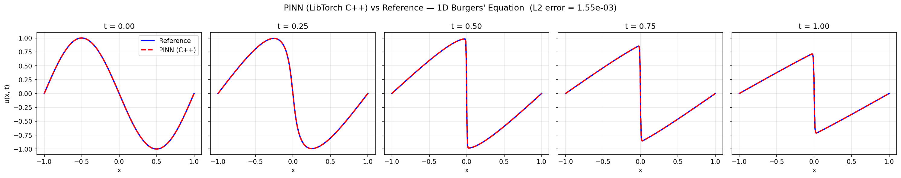
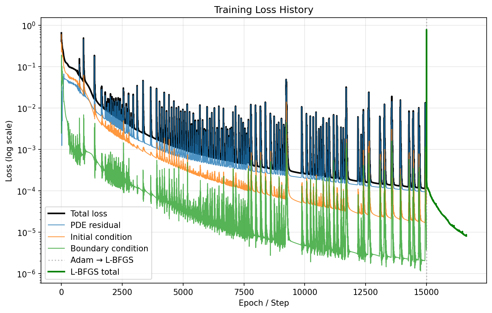

# PINN Burgers 1D — C++ Inference via LibTorch

A C++ inference pipeline for the Physics-Informed Neural Network (PINN)
that solves the 1D viscous Burgers' equation.  A single executable
handles the entire workflow: trains the model via Python, exports it as
TorchScript, loads it in C++ via LibTorch for inference, then validates
the result against a finite-difference reference solution and plots it —
all in one command.

This is the **`cpp` branch**.  The original Python-only implementation
lives on the [`main` branch](https://github.com/spatel81/pinn-burgers-1d/tree/main).

## What this solves

```
∂u/∂t + u·∂u/∂x = ν·∂²u/∂x²      x ∈ [−1, 1],  t ∈ [0, 1]

u(x, 0) = −sin(πx)                 initial condition
u(−1, t) = u(1, t) = 0             boundary conditions
ν = 0.01/π ≈ 0.00318               viscosity
```

## Result

Verified on Aurora (Intel Data Center GPU Max, `--device xpu`) with
15,000 Adam epochs plus L-BFGS fine-tuning:



**L2 relative error = 1.550 × 10⁻³** — inside the 10⁻³–10⁻² band Raissi
et al. report for this benchmark.  The dashed red curve is what LibTorch
computed in C++, not the Python model, so this figure exercises the
whole chain: training → `torch.jit.trace` → `torch::jit::load` →
forward pass.

Note the slices from t = 0.5 onward.  The smooth −sin(πx) profile
steepens into a near-discontinuity at x = 0 as the convection term
outruns the weak viscosity, and the network resolves that front without
the spurious oscillations a naive finite-difference scheme produces
there.  That front is also where the error concentrates — per-slice
figures from [docs/validation_errors.csv](docs/validation_errors.csv):

| t | L2 relative | max absolute |
|---|---|---|
| 0.00 | 1.40 × 10⁻³ | 2.27 × 10⁻³ |
| 0.25 | 1.04 × 10⁻³ | 2.65 × 10⁻³ |
| 0.50 | 2.05 × 10⁻³ | 1.53 × 10⁻² |
| 0.75 | 1.82 × 10⁻³ | 1.06 × 10⁻² |
| 1.00 | 1.34 × 10⁻³ | 5.07 × 10⁻³ |

The L2 error barely moves across time, but the max absolute error jumps
an order of magnitude at t = 0.5 — the network is accurate everywhere
except in the handful of points spanning the front, which is the
expected failure mode for this benchmark.

### Training



Adam brings the total loss to ~1.2 × 10⁻⁴ over 15,000 epochs; L-BFGS
fine-tuning then buys another factor of ~15, ending near 8 × 10⁻⁶.  The
periodic spikes during Adam are ordinary for PINNs — the optimizer
crossing a sharp ridge in the loss landscape, then recovering.  The
boundary-condition term (green) is satisfied most easily; the PDE
residual (blue) dominates the total throughout, which is why L-BFGS,
which attacks it directly, pays off.

Both figures are produced by the pipeline itself — reproduce them with
the single command in [Usage](#usage) below, written to
`build/output/`.  The copies here are from the verified Aurora run.

## How it works

```
./build/pinn_inference --device xpu
  │
  ├── [Step 1] Train & Export (Python)
  │     ├── Train PINN: Adam (15,000 epochs) + L-BFGS
  │     ├── torch.jit.trace(model, example_input)
  │     ├── Save pinn_burgers_traced.pt
  │     └── Write training_log.csv
  │
  ├── [Step 2] Load Model (LibTorch / C++)
  │     ├── torch::jit::load("pinn_burgers_traced.pt")
  │     └── model.to(device)  →  CPU or XPU
  │
  ├── [Step 3] Inference (LibTorch / C++)
  │     ├── Evaluate u(x, t) on 256 × 5 grid
  │     └── Write inference_results.csv
  │
  └── [Step 4] Validate & Plot (Python)
        ├── Reference solution: method of lines + scipy Radau
        ├── L2 relative error vs the C++ predictions
        └── Write pinn_vs_reference.png, training_loss.png
```

Step 4 validates what **LibTorch actually computed** — it reads the CSV
produced in Step 3, not the Python model.  A faulty TorchScript trace or
a mistake in the C++ grid construction shows up as a bad L2 error.

## Prerequisites

**On Aurora (Intel Data Center GPU Max / Sapphire Rapids):**
- `module load frameworks` — provides PyTorch (with XPU), LibTorch, numpy
- `module load cmake`
- Intel `icpx` compiler (included in the frameworks module)
- `pip install --user matplotlib scipy` — for Step 4 (not in the module)

**On a workstation:**
- Python 3.8+ with PyTorch ≥ 2.0, numpy, scipy, matplotlib
  (`pip install -r requirements.txt`)
- CMake ≥ 3.18
- LibTorch (download from [pytorch.org](https://pytorch.org/get-started/locally/))
- A C++17-compatible compiler (g++, clang++, or icpx)

scipy and matplotlib are needed only for Step 4.  Without them the
pipeline still trains and infers — pass `--no-validate`, or let the step
fail with a warning, and you keep `inference_results.csv`.

## Build

### On Aurora

```bash
module load frameworks cmake

mkdir -p build && cd build
cmake .. \
    -DCMAKE_CXX_COMPILER=icpx \
    -DCMAKE_PREFIX_PATH="$(python -c 'import torch; print(torch.utils.cmake_prefix_path)')"
make -j 4
cd ..
```

### On a workstation (with LibTorch)

```bash
mkdir -p build && cd build
cmake .. -DCMAKE_PREFIX_PATH=/path/to/libtorch
make -j 4
cd ..
```

## Usage

### Full pipeline (train + infer) — single command

```bash
# On Aurora (Intel GPU)
./build/pinn_inference --device xpu --output-dir build/output

# On CPU
./build/pinn_inference --device cpu --output-dir build/output

# Quick test (fewer epochs, no L-BFGS)
./build/pinn_inference --device cpu --epochs 1000 --no-lbfgs --output-dir build/output
```

### Inference only (skip training, reuse a model)

```bash
# Use a previously exported model
./build/pinn_inference --skip-training --model-path build/output/pinn_burgers_traced.pt --device xpu

# Or export first, then infer separately
python export/export_model.py --device xpu --output-dir build/output
./build/pinn_inference --skip-training --output-dir build/output --device xpu
```

### PBS submission on Aurora

Edit `submit_aurora.sh` — replace `<YOUR_PROJECT>` with your allocation
name, then:

```bash
qsub submit_aurora.sh
qstat -u $USER          # check status
```

Or use an interactive session:

```bash
qsub -I -A <YOUR_PROJECT> -q debug -l select=1 -l walltime=00:30:00
module load frameworks cmake
cd /path/to/pinn-burgers-1d
# Build and run as above
```

## CLI options

| Flag | Default | Description |
|---|---|---|
| `--device` | `cpu` | Inference device: `cpu` or `xpu` |
| `--output-dir` | `build/output` | Output directory for model and results |
| `--model-path` | *(auto)* | Path to existing TorchScript model (skips training) |
| `--epochs` | `15000` | Adam training epochs (forwarded to Python) |
| `--no-lbfgs` | *(off)* | Skip L-BFGS fine-tuning (forwarded to Python) |
| `--skip-training` | *(off)* | Skip training entirely, use existing model |
| `--no-validate` | *(off)* | Skip validation and plotting (Step 4) |
| `--nx` | `256` | Spatial grid points for inference |
| `--nt` | `5` | Time slices for inference |
| `--help` | | Show usage message |

## Output

Everything lands in the output directory (`build/output` by default):

| File | Written by | Contents |
|---|---|---|
| `pinn_burgers_traced.pt` | Step 1 | TorchScript model |
| `training_log.csv` | Step 1 | Per-epoch loss: `phase, step, total, pde, ic, bc` |
| `inference_results.csv` | Step 3 | `x, t, u_pred` — the C++/LibTorch predictions |
| `validation_errors.csv` | Step 4 | `t, l2_rel_error, max_abs_error` per slice + overall |
| `pinn_vs_reference.png` | Step 4 | PINN vs reference at each time slice |
| `training_loss.png` | Step 4 | Log-scale loss curves (PDE, IC, BC) |

`inference_results.csv` is the core result — one row per evaluation
point:

```csv
x,t,u_pred
-1.000000,0.000000,-0.000012
-0.992157,0.000000,-0.024541
...
```

With default settings it has 1,280 rows (256 x-points × 5 time slices at
t = 0.0, 0.25, 0.5, 0.75, 1.0).

### Validation

Step 4 builds a reference solution by the method of lines — central
finite differences in x on a 1024-point grid, integrated in t by scipy's
Radau implicit solver — then interpolates it onto the same points the
C++ binary evaluated and reports:

```
  L2 relative error:  1.550241e-03
  (Raissi et al. report ~1e-3 to 1e-2 for this setup)
```

`pinn_vs_reference.png` and `training_loss.png` are the figures shown in
[Result](#result) above; `validation_errors.csv` breaks the comparison
down per time slice.  The verified Aurora copies of all three are kept
in [docs/](docs/) for reference — a fresh run writes its own into the
output directory.

You can re-run validation on its own against an existing CSV:

```bash
python export/validate_and_plot.py --output-dir build/output
```

## Project structure

```
pinn-burgers-1d/          (cpp branch)
├── CMakeLists.txt          LibTorch build configuration
├── README.md               This file
├── LICENSE                 MIT license
├── requirements.txt        Python dependencies
├── .gitignore
├── docs/                   Verified Aurora run (the figures above)
│   ├── pinn_vs_reference.png
│   ├── training_loss.png
│   └── validation_errors.csv
├── src/
│   └── main.cpp            C++ driver: train → load → infer → validate
├── export/
│   ├── export_model.py     Python: train PINN + export TorchScript
│   └── validate_and_plot.py  Python: reference solution + error + plots
└── submit_aurora.sh        PBS job script for Aurora
```

## License

MIT — see [LICENSE](LICENSE).
